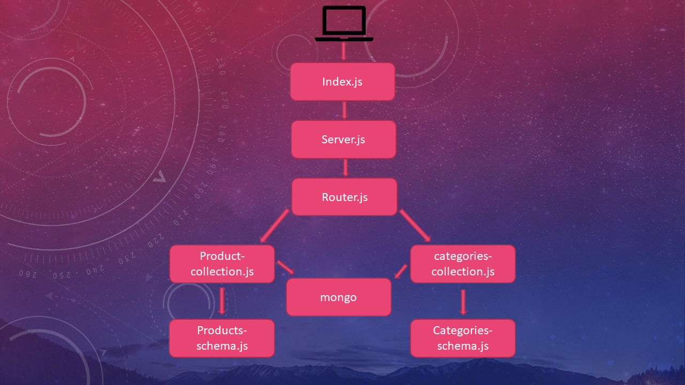

# LAB: Express
we’ll be using a moving away from json-server and creating a “real” API server of our own, using Express. Our express server will be coded for modularity and performance.we will be migrating from in-memory data storage to using Mongo to store our data permanently, and modularizing our routes for flexibility. Through it all, we will be providing the same interface to our users. To the outside world, our API remains unchanged
### Author: Osama Mousa
### Links and Resources
- [submission PR class-09](https://github.com/401-advanced-javascript-osama/api-server/pull/6)
### Documentation

* [swagger](https://app.swaggerhub.com/apis/osamamousa204/mongo-api/0.1)

### Modules
#### `Node.js` , `Postman` , `Swagger` , `HTTPie` , `curl`
### Packages
#### `express` , `jest` , `supertest`
#### How to initialize/run your application
- GET ALL: GET - http://localhost:3030/api/v1/categories
- GET ONE: GET - http://localhost:3030/api/v1/categories/1
- UPDATE ONE:  PUT - http://localhost:3030/api/v1/categories/1
- DELETE ONE: DELETE - http://localhost:3030/api/v1/categories/1
- GET ALL: GET - http://localhost:3030/api/v1/products
- GET ONE: GET - http://localhost:3030/api/v1/products/1
- UPDATE ONE:   PUT - http://localhost:3030/api/v1/products/1
- DELETE ONE: DELETE - http://localhost:3030/api/v1/products/1
#### Tests
- Test: `node index.js` / `nodemon` / `npm test` / `npm run lint`
#### UML

