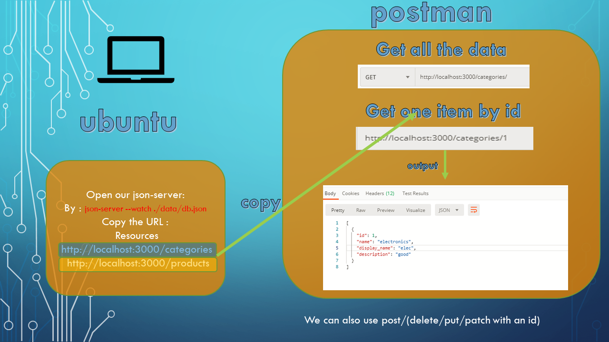

# API-SERVER
### Author: Osama Mousa 
### Links and Resources
- [Swagger](https://app.swaggerhub.com/apis/osamamousa204/api-server/0.1)
- [pull request](https://github.com/401-advanced-javascript-osama/api-server/pull/2)
### Setup
#### `.env` requirements
- `PORT` - 3030
#### UML

